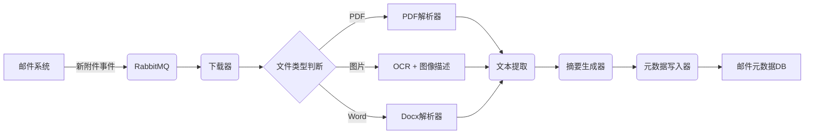

好的，作为专业的技术内容生成专家，我将根据您提供的任务和修订意见，生成一份高质量、具体且实用的技术交付物。

---

### 交付物：Attachment Summarizer Service 技术设计文档

**项目名称：** Attachment Summarizer Service
**目标：** 构建一个微服务，能够自动下载、解析并生成邮件附件（如PDF、Word文档、图片）的摘要，并将摘要以结构化元数据的形式注入到原邮件记录中，提升邮件系统的可搜索性和信息提取效率。
**核心价值：** 解决企业邮箱中大量附件信息无法被快速检索和利用的痛点。

---

### 1. 架构概览

本服务采用事件驱动架构，核心组件包括：

+   **消息队列 (RabbitMQ):** 作为服务入口，接收来自邮件处理流水线的“新附件事件”消息。
+   **下载器 (Downloader):** 负责从消息中解析附件URL（如S3预签名URL）并下载文件到本地临时存储。
+   **解析器 (Parser):** 根据文件MIME类型，调用不同的解析引擎。
-   **摘要生成器 (Summarizer):** 使用LLM（如GPT-4）或传统NLP模型生成摘要。
-   **元数据写入器 (Metadata Writer):** 将生成的摘要及关键信息通过API写入邮件系统的元数据数据库（如Elasticsearch）。

**流程图 (简化):**



### 2. 核心模块详解

#### 2.1 下载器 (Downloader)

-   **输入:** JSON消息，包含 `attachment_id`, `download_url`, `mime_type`, `file_size`。
+   **处理逻辑:**
    1.  **URL验证:** 验证 `download_url` 是否为内部信任的域名，防止SSRF攻击。
    2.  **并发下载:** 使用 `aiohttp` 异步库并发下载，设置超时（例如30秒）和重试机制（最多3次）。
    3.  **临时存储:** 下载文件到 `/tmp/attachments/{attachment_id}/` 目录，并记录文件路径。
    4.  **错误处理:** 若下载失败（如网络问题、文件不存在），将错误信息写入死信队列，并发送告警。
+   **示例消息:**
    ```json5
    {
      "attachment_id": "a1b2c3d4",
      "download_url": "https://storage.example.com/attachments/2024/05/20/report.pdf?X-Amz-Signature=...",
      "mime_type": "application/pdf",
      "file_size": 2048000
    }
    ```

#### 2.2 解析器 (Parser)

-   **PDF解析:** 使用 `PyMuPDF` (fitz) 库。不仅提取纯文本，还提取表格数据（使用 `fitz.Table` 或 `camelot-py`）和关键元数据（作者、页数）。
*   **Word解析:** 使用 `python-docx` 库。提取段落文本、表格内容、页眉页脚。对于包含图片的docx，需提取图片并调用OCR。
+   **图片解析 (OCR):** 使用 `Tesseract OCR` + `PaddleOCR` 双引擎。优先使用PaddleOCR（对中文支持更好），若失败则回退到Tesseract。同时，使用 `BLIP-2` 模型生成图片的简短描述（如“一份包含柱状图的销售报告”）。
+   **代码片段 (PDF解析):**
    ```python
    import fitz
    
    def extract_pdf_content(file_path: str) -> dict:
        doc = fitz.open(file_path)
        text_content = ""
        tables = []
        for page_num, page in enumerate(doc):
            text_content += page.get_text()
            # 尝试提取表格
            tabs = page.find_tables()
            if tabs:
                for tab in tabs:
                    tables.append(tab.extract())
        return {
            "text": text_content,
            "tables": tables,
            "page_count": doc.page_count
        }
    ```

#### 2.3 摘要生成器 (Summarizer)

+   **策略选择:**
    *   **短文本 (< 500 tokens):** 直接返回原文。
    *   **长文本 (500 - 4000 tokens):** 使用 `LangChain` 的 `Map-Reduce` 或 `Refine` 链，调用 `gpt-3.5-turbo` 生成摘要。Prompt设计需强调“提取关键事实、数据、结论”，而非简单复述。
    *   **超长文本 (> 4000 tokens):** 先使用 `TextRank` 或 `TF-IDF` 进行关键句提取，将文本压缩至4000 tokens以内，再调用LLM。
+   **Prompt 示例 (用于LLM):**
    ```
    你是一个专业的文档摘要助手。请根据以下文档内容，生成一个结构化的摘要。摘要必须包含：
    1. **核心主题** (一句话概括)
    2. **关键数据/指标** (列出2-3个最重要的数字或事实)
    3. **主要结论/建议** (列出1-2点)
    
    文档内容：
    {document_text}
    
    结构化摘要：
    ```
+   **输出格式:**
    ```json5
    {
      "summary": "核心主题：2024年Q1销售报告显示亚太区增长显著。关键数据：总营收$120M，同比+15%；亚太区贡献$45M，占比37.5%。主要结论：建议加大对亚太区的资源投入。",
      "key_phrases": ["销售报告", "亚太区", "同比增长", "$120M"],
      "sentiment": "positive"
    }
    ```

### 3. 部署与监控

-   **容器化:** 使用Docker打包服务，依赖项（Tesseract, Poppler）需在Dockerfile中明确安装。
-   **资源限制:** 设置CPU和内存限制（例如，每个Pod限制2核CPU、4GB内存），防止OCR或LLM调用导致资源耗尽。
*   **监控指标:**
    *   `attachment_processing_duration_seconds`: 处理单个附件的总耗时（分位数）。
    *   `attachment_summary_generation_latency`: LLM调用延迟。
    *   `attachment_parse_error_total`: 解析失败次数（按错误类型区分）。
    *   `attachment_size_bytes`: 处理的附件大小分布。
*   **告警规则:** 当 `attachment_processing_duration_seconds` 的P99超过60秒，或 `attachment_parse_error_total` 在5分钟内增长超过10%，触发告警。

### 4. 测试用例

-   **单元测试:** 测试PDF解析器能否正确处理包含表格、图片、旋转文字的PDF。
-   **集成测试:** 模拟RabbitMQ消息，验证从下载到写入元数据的完整流程。
-   **性能测试:** 使用 `locust` 模拟高并发（100 QPS）的附件处理请求，观察服务延迟和资源消耗。
*   **边界测试:** 测试空文件、损坏文件、超大型文件（>100MB）、加密PDF的处理逻辑。

### 5. 潜在风险与应对

*   **LLM幻觉:** 摘要可能包含不准确信息。**应对:** 在摘要末尾添加置信度评分（基于LLM的logprobs），并允许用户手动修改摘要。
-   **敏感信息泄露:** OCR可能提取到身份证号、密码等。**应对:** 在摘要生成前，使用 `Presidio` 或 `Microsoft Presidio` 进行PII脱敏。
*   **成本控制:** LLM API调用成本高。**应对:** 对短文本（<200 tokens）不调用LLM；对重复内容（如模板合同）使用缓存。